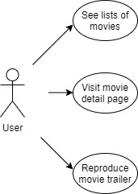
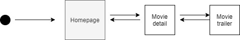
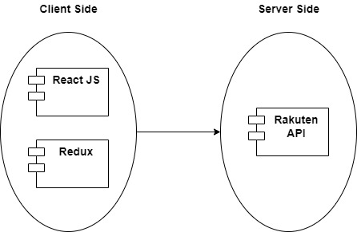
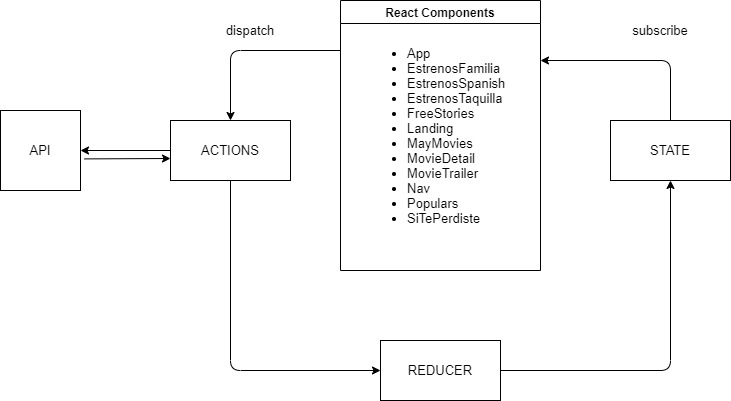
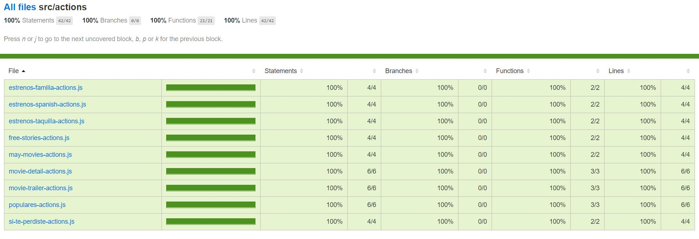
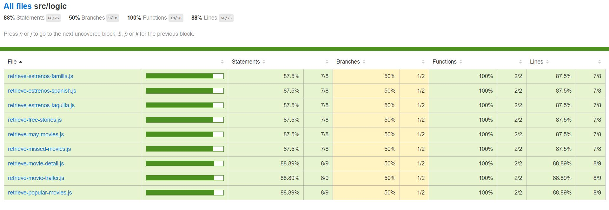
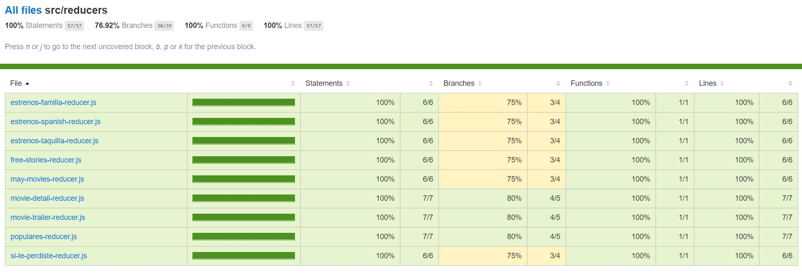

# RAKUTEN TV ASSIGNMENT
## Description

In this assignment I have created a web application that simulates a part of the official Rakuten TV website. In it, user will be able to see lists of movies ordered by different categories, enter the detail of each one of them and reproduce the corresponding movie trailer. The website is fully responsive and adaptable to devices such as tablet and mobile.

# Functional Description

The main features included in this app are the following:

1. User can do:

- See different lists of movies within the homepage
- Visit movie detail page
- Reproduce movie trailer

## Use Cases

## Workflow

# Technical Description

## Blocks

## Modules

# Test Code Coverage

## Sync Action Creators

## Async Action Creators

## Reducers

